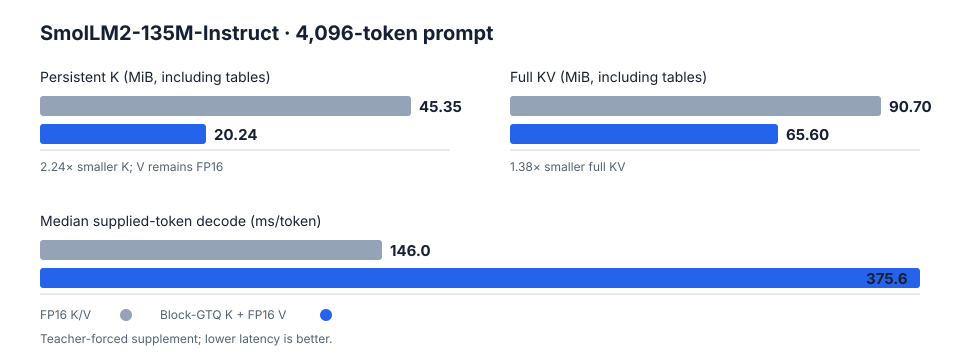

# block-gtq-webgpu

A WebGPU/WGSL port of Block-GTQ key-cache compression, integrated with SmolLM2-135M-Instruct.

At a 4,096-token prompt, persistent K storage including shared tables drops from **45.35 MiB to 20.24 MiB**—about **2.24× smaller**. Because V remains FP16, the full KV cache drops from **90.70 MiB to 65.60 MiB**. The compressed path is slower end to end.



## Results

SmolLM2-135M-Instruct, 4,096-token prompt, Intel Gen12LP graphics, Windows 11, Chrome 152:

| Measurement | FP16 K/V | Block-GTQ K + FP16 V |
|---|---:|---:|
| Persistent K, including tables | 45.35 MiB | 20.24 MiB |
| Full KV, including tables | 90.70 MiB | 65.60 MiB |
| Maximum live explicit buffers | 357.84 MiB | 332.74 MiB |
| Median prefill | 93.16 s | 111.19 s |
| Median supplied-token decode | 146.0 ms/token | 375.6 ms/token |

The K allocation is 2.24× smaller; the full KV cache is 1.38× smaller. Supplied-token decode is a teacher-forced timing supplement, not autonomous generation throughput. See the [raw model run](benchmarks/raw/2026-09-15T10-43-22-413Z-model.json), [decode supplement](benchmarks/raw/2026-09-15T10-52-04-928Z-model-decode.json), and [measurement notes](benchmarks/README.md).

The optimized synthetic compressed-attention path removed full reconstructed-K scratch and reduced the 4,096 × 128 benchmark from 47.78 ms to 2.16 ms while passing its correctness gates. This isolated result does not imply faster model inference; see the [raw attention record](benchmarks/raw/2026-09-15T09-27-00-112Z-phase4-phase4-bench.json).

## Quick start

Requirements: Python 3.12, Node.js 24, and a WebGPU-capable Chromium browser.

```sh
python -m pip install -r requirements.txt -r requirements-model.txt
python -m pip install -e . --no-deps
python scripts/setup_model.py
npm ci
npm run demo
```

Open `http://127.0.0.1:8080`. The demo provides the two minimal inference paths:

- **FP16 K/V** — ordinary inference with both cache tensors in FP16.
- **Block-GTQ K + FP16 V** — compressed post-RoPE K with V unchanged.

The first model setup downloads about 269 MB and exports about 269 MB of local FP16 weights under the ignored `models/smollm2/` directory.

## How it works

```text
SmolLM2
  ├── Q ──────────────────────────┐
  ├── K → Block-GTQ → packed K ───┤→ attention
  └── V → FP16 cache ──────────────┘
```

Block-GTQ allocates bit widths to RoPE frequency pairs using calibrated Q/K energy. Equal-width pairs are grouped, rotated, quantized, and packed with FP16 scales. During decode, only each new post-RoPE key is encoded. Attention reconstructs groups inside the WGSL workgroup and immediately consumes them for QK; the model path never materializes the full historical K tensor.

SmolLM2 uses nine query heads and three shared KV heads. This implementation is intentionally fixed to the pinned model specification in [`models/model.json`](models/model.json).

## Benchmarks

Reproduce the saved evaluations with:

```sh
npm run bench:model
npm run bench:model:decode
npm run bench:attention
```

Benchmark programs live in `benchmarks/`; immutable final records live in `benchmarks/raw/`. Generated plots and local profiling output are ignored. Hardware, warmup, timing boundaries, prompt IDs, samples, buffer ledgers, output tokens, and source hashes are stored in each record.

## Validation

```sh
npm test
```

The suite covers allocator and bit assignment, nibble/byte packing, production quantization math, WebGPU encode/decode, baseline and compressed attention, live cache append, RoPE, and FP16/compressed model integration. Python references and export utilities live in `src/reference/` and `tests/oracles/`; deterministic fixtures live in `fixtures/`.

GPU attention is checked separately from full-model propagation. The compressed attention path passes 120 strict comparisons when supplied identical effective Q/K/V inputs (maximum local error `2.38e-6`). Full-model CPU/WebGPU differences remain reported rather than hidden by relaxed tolerances.

## Limitations

- Only K is compressed; V remains FP16.
- Block-GTQ is slower than FP16 end to end in the measured model workloads.
- Full-model logits and generated text diverge. Broad model-quality retention is not established.
- No out-of-memory or usable context-length advantage has been established.
- Exact parity with the upstream CUDA/Triton encoder is not claimed.
- Explicit buffer accounting does not measure driver reservations or physical peak VRAM.

## Upstream and citation

The algorithm and vendored oracle fragments come from [JIA-Lab-research/blockgtq](https://github.com/JIA-Lab-research/blockgtq), pinned at commit [`3fe14e7`](https://github.com/JIA-Lab-research/blockgtq/commit/3fe14e7d4b8a6c85402818f7e22052527ed42e93). Upstream code under `vendor/blockgtq/` remains Apache-2.0 and retains its own license. The TypeScript/WGSL runtime in this repository is a separate WebGPU port.

```bibtex
@article{blockgtq2026,
  title   = {RoPE-Aware Bit Allocation for KV-Cache Quantization},
  author  = {Liang, Fengfeng and Zhang, Yuechen and Jia, Jiaya},
  journal = {arXiv preprint arXiv:2606.24033},
  year    = {2026}
}
```

## License

Original project code is available under the [MIT License](LICENSE). Vendored Block-GTQ code and reference modules marked as adapted from it remain covered by [Apache-2.0](vendor/blockgtq/LICENSE).
